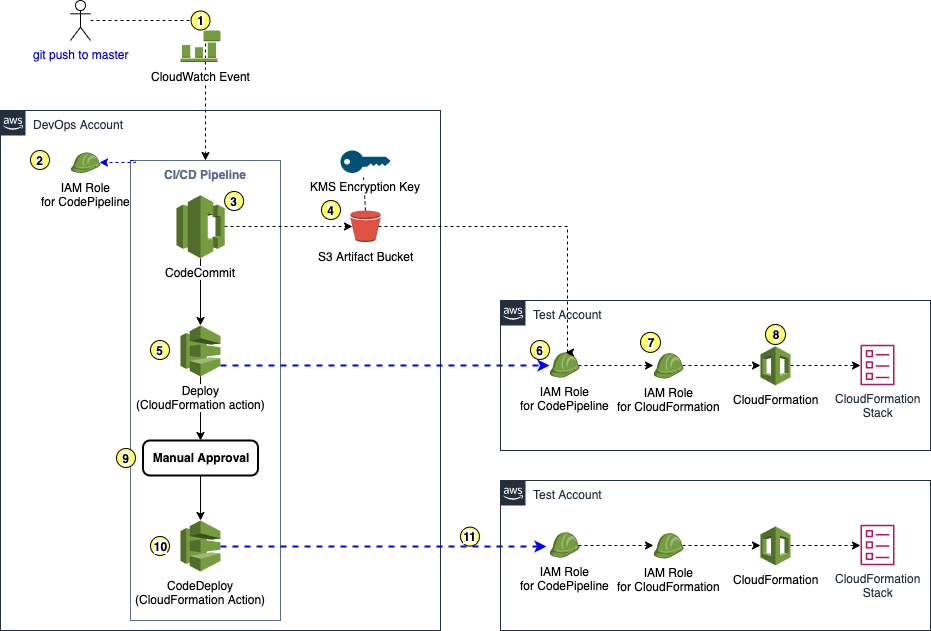

# AWS Multi-Account CI/CD Pipelines

This project demonstrates how to create multi-account CI/CD deployment pipelines using AWS-native services, including CodeCommit, CodePipeline, CodeBuild, CodeDeploy, and more. 

Normally, I would recommend the AWS CDK, rather than writing CloudFormation "by hand" or using the AWS CLI to create certain resources (as I do in this project). However, I wanted to do demonstrate how to do this "by hand" for those not using the CDK. The other reason is that the CDK abstracts a number of aspects, and for my own learning, I like doing things at a lower level for learning purposes. 

## Usage

This project is meant as an illustrative demo and not intended for production usage as-is. 

## Status

At the moment, this project has a working example of cross-account CI/CD workflows whereby you can define an "infrastructure" CodeCommit repository in a DevOps account that is intended to hold a CloudFormation template (`cloudformation.yaml`). The DevOps account also has an AWS CodePipeline pipeline that is triggered upon commits to the repository and then launches the stack in a test account, waits for manual approval, and then launches the stack in the production account. 

Deployment instructions below are not yet completed... but you can look in `deployment-commands.sh` to see all commands that you need to run in order. 

I will eventually work on automating more aspects of the deployment process, better documentation, and additional CI/CD examples. 

## Deployment

1. Install `gettext` to help with generating example template files. If on MacOS, use `brew install gettext`. This is used to dynamically insert environment variables from `config.sh` into some of our templatized CLI commands.

1. Make sure your local AWS CLI has been configured with a profile for each of your devops, test, and production accounts. Afterward, export the profile names and account IDs of each account: 

    ```sh
    export DEVOPS_PROFILE="your_devops_profile"
    export TEST_PROFILE="your_test_profile"
    export PROD_PROFILE="your_prod_profile"

    export DEVOPS_ACCOUNT_ID="111111111111"
    export TEST_ACCOUNT_ID="222222222222"
    export PROD_ACCOUNT_ID="333333333333"
    ```

1. Optionally, edit any other parameters in `config.sh`. These parameters control things such as the name of the IAM roles, pipeline resources, etc. that will be created. 

1. Run `./deploy.sh`. This single script will create empty CodeCommit repositories attached to their own CI/CD pipelines in the DevOps account, as well as cross-account IAM roles in the test and prod account needed for deployment.

1. The `lib/codecommit-examples` directory contains a folder with source code for each of the demo CI/CD pipelines. Push the code from each folder to its respective CodeCommit repository in your DevOps account and watch as the CI/CD pipeline triggers. 

## Diagrams & Examples

### Infrastructure Pipeline

This pipeline is used for launching CloudFormation stacks in your test and prod account. It expects that you will commit a `cloudformation.yaml` template to the CodeCommit repository's master branch in your DevOps account. This will trigger the pipeline to deploy the template as a new (or updated) stack, as further described below:  



1. **CloudWatch Event** triggers CodePipeline in the DevOps account when a commit is made to the master branch of the CodeCommit pipeline. 

2. **CodePipeline** initially assumes an IAM service role in the DevOps account allowing it to execute each step of the pipeline. This role must have a trust policy for the `codepipeline.amazonaws.com` principle. When you create a pipeline in the console, you will be prompted to create a new role or use an existing role. In our project, we explicitly create this role with an included CloudFormation template. We need to do this because we need to reference this role in the access policies of other resources we create, such as our pipeline artifact S3 bucket. 

3. **The CodeCommit source action** of CodePipeline will read the contents of the CodeCommit repository. To do this, CodeCommit will use the same role as CodePipeline to perform this action.

4. Whenever input artifacts (like a CodeCommit repo) are pulled into a pipeline, or outputs are generated (e.g. from a CodeBuild project), CodePipeline will automatically store them as a zip file in an "artifact" S3 bucket in the DevOps account. This bucket *must* be encrypted using KMS. 

5. **The CloudFormation deployment action** specifies the name of the file from the source artifact (e.g. `cloudformation.yaml`), as well as the name of the CloudFormation stack to create. 

6. In order for CodePipeline in the DevOps account to tell CloudFormation in the test account to launch your CloudFormation stack, the pipeline must assume a cross-account IAM role in the Test account. The cross-account role in the test account must have a trust policy allowing the DevOps account to assume it (i.e. `arn:aws:iam::<DevOpsAccountId>:root`), and the CodePipeline service role must have an IAM policy granting `sts:AssumeRole` on the cross-account role in the test account.

7. When CodePipeline invokes CloudFormation in the test account, it must also specify an IAM role that gives CloudFormation permissions to create resources. This role exists in the test account and has a trust policy allowing `cloudformation.amazonaws.com` to assume the role. 

8. If the CloudFormation stack is successfully launched in the Test account, the pipeline moves to a manual approval step. You can optionally configure this approval step to send an SNS notification alerting someone that a deployment is pending approval. 

9. If manual approval is given, a deployment is made to the prod account in the same way that the test account was deployed.